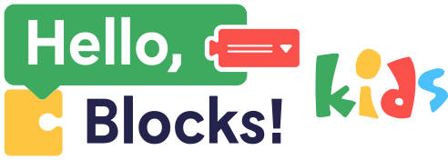

<p align="center">
	
</p>

<h1 align="center">The Wave 2026 - Finalistas</h1>

<p align="center">
	Proyecto de hackathon enfocado en aprendizaje de programacion por bloques para ninos.
</p>

## Resumen

The Wave es una experiencia educativa interactiva construida con React + Vite y un backend en Node.js.
Incluye misiones, progresion de perfiles y soporte de pistas con IA para guiar a los jugadores.

## Stack Tecnologico

- Frontend: React, Vite, Blockly, Framer Motion
- Backend: Node.js, Express
- Integracion IA: Mistral (proxy desde Vite)
- Hardware: flujo de compilacion/carga para Arduino en backend

## Demo Local

### 1) Frontend

```bash
npm install
npm run dev
```

### 2) Backend

```bash
cd backend
npm install
npm run dev
```

## Estructura del Proyecto

```text
.
|- src/            # Interfaz principal, componentes y logica cliente
|- public/         # Assets estaticos (incluye logo)
|- backend/        # API, integracion Arduino y servicios backend
|- aiConfig.js     # Configuracion de clave para Mistral
```

## Nota Importante sobre Mistral

La clave de Mistral esta actualmente hardcodeada en `aiConfig.js`.
Por ese motivo SEGURAMENTE no funcionará cuando TÚ lo pruebes (clave expirada, revocada o sin permisos).


## Estado

- Hackathon The Wave 2026
- Resultado: Finalistas